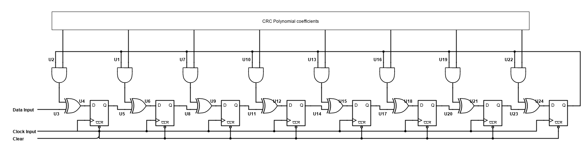

# CRC (Cyclic Redundancy Check)

The cyclic Redundancy Check is used for error detection. It uses shift registers and XOR operation for calculating a value similar to a hash, but used for error detection, instead of security.

The circuit is the same as the one used by Ben Eater in his CRC on a breadboard series, but uses an and gate to use the CRC polynomial coefficients, instead of connecting the XOR gates permanently, enabling different CRC polynomials to be used.

---

## References
1) [Ben eater : How does CRC work?](https://www.youtube.com/watch?v=izG7qT0EpBw)
2) [Ben eater : CRC in hardware](https://www.youtube.com/watch?v=sNkERQlK8j8)
