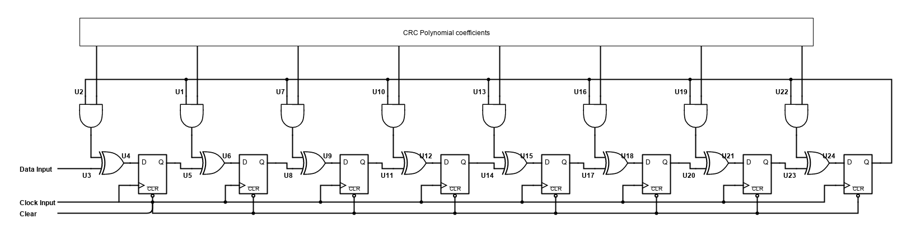
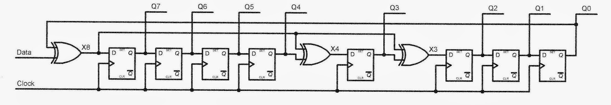

# CRC (Cyclic Redundancy Check) in verilog

The cyclic Redundancy Check is used for error detection. It uses shift registers and XOR operation for calculating a value similar to a hash, but used for error detection, instead of security.

The circuit is the same as the one used by Ben Eater in his CRC on a breadboard series, but uses an and gate to get the CRC polynomial coefficients, instead of connecting the XOR gates permanently, enabling different CRC polynomials to be used.

In the above circuit, the coefficients cannot be changed. The circuit must be designed by hand for each polynomial. For creating a flexible component, my version uses AND gates.

The property of XOR that it acts like a selective NOT gate is very useful here. Our objective is to have the last bit of the CRC feed into the XOR gates only where the CRC polynomial is 1.

My circuit accomplishes this via the AND gate. When the polynomial coefficient is 0, the XOR gate gets 0 input, effectively making it a buffer. When the polynomial coefficient is 1, the last bit is fed to the XOR gates.

Synthesis tools will be able to optimize the XOR and AND gates away and generate the optimized structure, since the polynomial is a parameter.

---

## References
1) [Ben eater : How does CRC work?](https://www.youtube.com/watch?v=izG7qT0EpBw)
2) [Ben eater : CRC in hardware](https://www.youtube.com/watch?v=sNkERQlK8j8)
