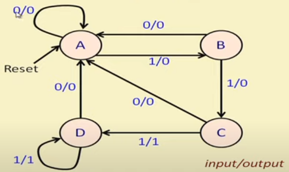
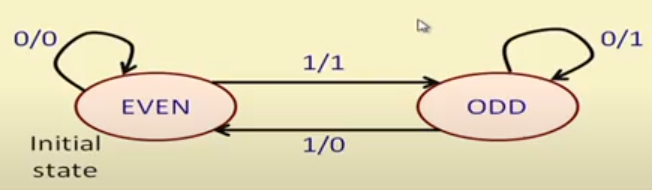

# Pattern Detector Finite State Machine

A finite state machine (FSM) that detects some pattern in a bitstream. This folder implements several FSMs.

---

## Three consecutive ones

Let us try to detect the patter ```111``` in a bitstream (with overlap). The state transition diagram of the FSM will look like



From this, we make a table. We can use case statement to easily implement it as a sequential circuit.

```verilog
case({state, in})
    3'b001  : assign {state, out} = 3'b010;
    3'b000  : assign {state, out} = 3'b000;
    3'b011  : assign {state, out} = 3'b100;
    3'b010  : assign {state, out} = 3'b000;
    3'b101  : assign {state, out} = 3'b111;
    3'b100  : assign {state, out} = 3'b000;
    3'b111  : assign {state, out} = 3'b111;
    3'b110  : assign {state, out} = 3'b000;
    default : assign {state, out} = 3'b000; 
endcase
```

---

## Serial parity detector

Here we need to count the number of ones. The output must be ```1``` if number of ones was odd and ```0``` for even. This is the state transition diagram for the FSM.


 
The above diagram is for a moore machine. But, we can implement this as a mealy machine also with same number of states. Output for even state will be 0 and for odd state will be 1.


